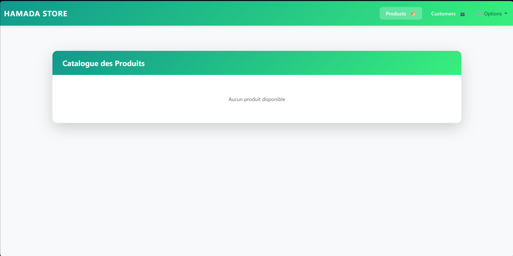
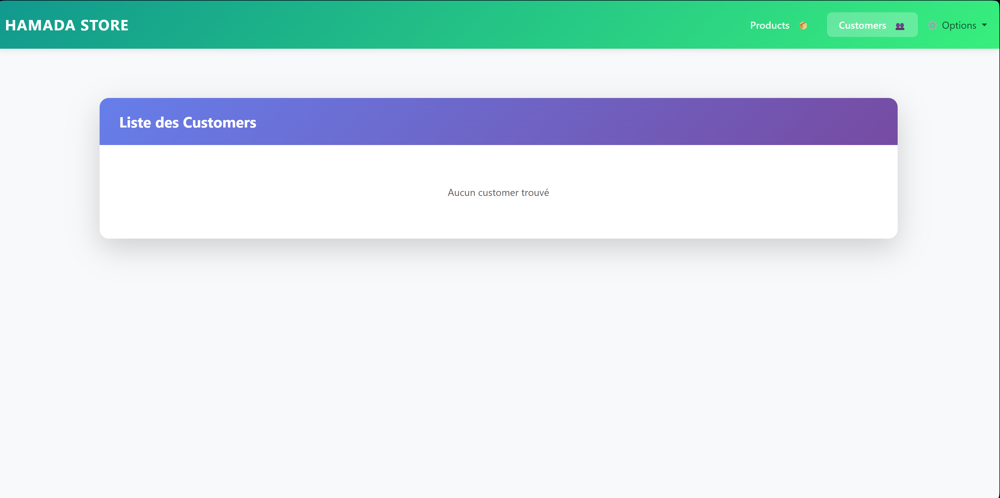
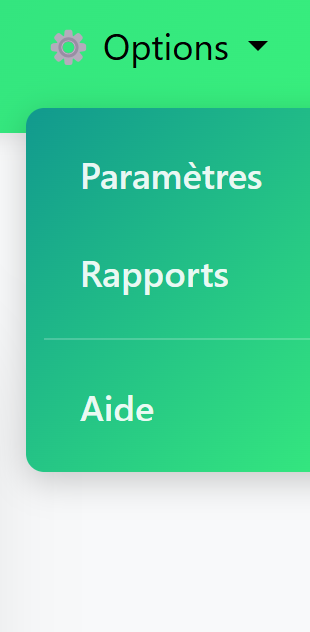

# Qejiou-Exam-Final - E-Commerce Microservices Platform

## 📋 Description

Cette application est une plateforme e-commerce complète basée sur une architecture **microservices** avec **Spring Boot** et **Spring Cloud**. Elle utilise **Angular** pour le frontend et **Keycloak** pour la sécurité OAuth2/OpenID Connect.

---

## 🏗️ Architecture

```
┌─────────────────────────────────────────────────────────────────────────┐
│                           FRONTEND (Angular)                            │
│                              Port: 4200                                 │
└─────────────────────────────────────────────────────────────────────────┘
                                    │
                                    ▼
┌─────────────────────────────────────────────────────────────────────────┐
│                         GATEWAY SERVICE                                 │
│                            Port: 8888                                   │
│              (API Gateway + Load Balancing + CORS)                      │
└─────────────────────────────────────────────────────────────────────────┘
                                    │
            ┌───────────────────────┼───────────────────────┐
            ▼                       ▼                       ▼
┌─────────────────┐     ┌─────────────────┐     ┌─────────────────┐
│ CUSTOMER-SERVICE│     │ INVENTORY-SERVICE│    │ BILLING-SERVICE │
│    Port: 8081   │     │    Port: 8082    │    │    Port: 8083   │
└─────────────────┘     └─────────────────┘     └─────────────────┘
            │                       │                       │
            └───────────────────────┼───────────────────────┘
                                    ▼
┌─────────────────────────────────────────────────────────────────────────┐
│                      DISCOVERY SERVICE (Eureka)                         │
│                              Port: 8761                                 │
└─────────────────────────────────────────────────────────────────────────┘
                                    │
                                    ▼
┌─────────────────────────────────────────────────────────────────────────┐
│                         CONFIG SERVICE                                  │
│                            Port: 9999                                   │
│              (Configuration centralisée via Git)                        │
└─────────────────────────────────────────────────────────────────────────┘

┌─────────────────────────────────────────────────────────────────────────┐
│                           KEYCLOAK (OAuth2)                             │
│                            Port: 8180                                   │
│                   (Authentification & Autorisation)                     │
└─────────────────────────────────────────────────────────────────────────┘
```

---

## 📦 Microservices

| Service | Port | Description |
|---------|------|-------------|
| **discovery-service** | 8761 | Service de découverte Eureka pour l'enregistrement des microservices |
| **config-service** | 9999 | Serveur de configuration centralisée Spring Cloud Config |
| **gateway-service** | 8888 | API Gateway avec Spring Cloud Gateway (routage, CORS, load balancing) |
| **customer-service** | 8081 | Gestion des clients (CRUD) avec Spring Data JPA + H2 |
| **inventory-service** | 8082 | Gestion de l'inventaire des produits |
| **billing-service** | 8083 | Gestion de la facturation |
| **ecom-web-app** | 4200 | Frontend Angular avec Bootstrap 5 |

---

## 🛠️ Technologies Utilisées

### Backend
- **Java 21**
- **Spring Boot 3.5.7**
- **Spring Cloud 2025.0.0**
  - Spring Cloud Netflix Eureka (Discovery)
  - Spring Cloud Config (Configuration)
  - Spring Cloud Gateway (API Gateway)
- **Spring Security OAuth2** (Resource Server)
- **Spring Data JPA**
- **H2 Database** (Base de données en mémoire)
- **Lombok**

### Frontend
- **Angular 19.2**
- **Bootstrap 5.3**
- **Bootstrap Icons**
- **TypeScript 5.7**

### Infrastructure
- **Docker & Docker Compose**
- **Keycloak 24.0** (Identity Provider)
- **PostgreSQL 15** (Base de données Keycloak)

---

## 🚀 Démarrage du Projet

### Prérequis
- Java 21+
- Maven 3.9+
- Node.js 18+
- Docker & Docker Compose

### 1. Démarrer l'infrastructure (Keycloak + PostgreSQL)

```bash
docker-compose up -d
```

**Services Docker :**
- PostgreSQL (Keycloak) : `localhost:5433`
- Keycloak : `localhost:8180`
  - Admin Console : http://localhost:8180
  - Username : `admin`
  - Password : `admin`

### 2. Démarrer les Microservices Backend

**Ordre de démarrage recommandé :**

```bash
# 1. Discovery Service (Eureka)
cd discovery-service
./mvnw spring-boot:run

# 2. Config Service
cd config-service
./mvnw spring-boot:run

# 3. Gateway Service
cd gateway-service
./mvnw spring-boot:run

# 4. Business Services (peuvent être démarrés en parallèle)
cd customer-service
./mvnw spring-boot:run

cd inventory-service
./mvnw spring-boot:run

cd billing-service
./mvnw spring-boot:run
```

### 3. Démarrer le Frontend Angular

```bash
cd ecom-web-app-main/ecom-web-app-main
npm install
npm start
```

Le frontend sera accessible sur : **http://localhost:4200**

---

## 🔗 URLs des Services

| Service | URL |
|---------|-----|
| Eureka Dashboard | http://localhost:8761 |
| Gateway API | http://localhost:8888 |
| Keycloak Admin Console | http://localhost:8180 |
| Frontend Angular | http://localhost:4200 |
| Customer Service (direct) | http://localhost:8081 |
| Inventory Service (direct) | http://localhost:8082 |
| Billing Service (direct) | http://localhost:8083 |

---

## 📸 Captures d'écran

### 🛒 Page Catalogue des Produits

<p align="center">
  
</p>

**Description :** Cette page affiche le catalogue complet des produits disponibles dans le magasin "HAMADA STORE". 
- **Navigation** : Barre de navigation avec accès aux sections Products, Customers et Options
- **Design** : Interface moderne avec un dégradé vert/turquoise
- **Fonctionnalité** : Affichage dynamique des produits récupérés depuis le `inventory-service` via le Gateway

---

### 👥 Page Liste des Clients

<p align="center">
  
</p>

**Description :** Cette page permet de gérer la liste des clients enregistrés dans le système.
- **Service Backend** : Les données proviennent du `customer-service` (port 8081)
- **API REST** : Utilise Spring Data REST pour les opérations CRUD
- **Sécurité** : Accès protégé par Keycloak OAuth2/JWT

---

### ⚙️ Menu Options

<p align="center">
  
</p>

**Description :** Menu déroulant offrant des fonctionnalités supplémentaires :
- **Paramètres** : Configuration de l'application utilisateur
- **Rapports** : Génération de rapports et statistiques
- **Aide** : Documentation et support utilisateur

---

## 🔐 Configuration Keycloak

1. Accéder à http://localhost:8180
2. Se connecter avec `admin` / `admin`
3. Créer un Realm : `billing-app`
4. Créer un Client pour l'application frontend
5. Configurer les rôles et utilisateurs

---

## 📁 Structure du Projet

```
Qejiou-exam-final/
├── billing-service/          # Service de facturation
├── config-repo/              # Repository de configuration Git
│   ├── customer-service.properties
│   ├── inventory-service.properties
│   └── billing-service.properties
├── config-service/           # Serveur de configuration
├── customer-service/         # Service clients
├── discovery-service/        # Eureka Server
├── gateway-service/          # API Gateway
├── inventory-service/        # Service inventaire
├── ecom-web-app-main/        # Frontend Angular
├── demo-chatbot-rag/         # Chatbot avec RAG
├── emsi-bot/                 # Bot EMSI
├── docker-compose.yml        # Infrastructure Docker
└── pom.xml                   # POM parent Maven
```

---

## 🔄 Configuration Centralisée

Le service `config-service` lit les configurations depuis le dossier `config-repo/`. Chaque service peut avoir des profils:
- `{service-name}.properties` - Configuration par défaut
- `{service-name}-dev.properties` - Configuration développement
- `{service-name}-prod.properties` - Configuration production

---

## 📡 API Endpoints (via Gateway)

Tous les endpoints passent par le Gateway sur le port **8888** :

- `GET /CUSTOMER-SERVICE/customers` - Liste des clients
- `GET /INVENTORY-SERVICE/products` - Liste des produits
- `GET /BILLING-SERVICE/bills` - Liste des factures

---

## 👨‍💻 Auteur

Projet d'examen - Architecture Microservices avec Spring Cloud

---

## 📄 License

Ce projet est à des fins éducatives.
